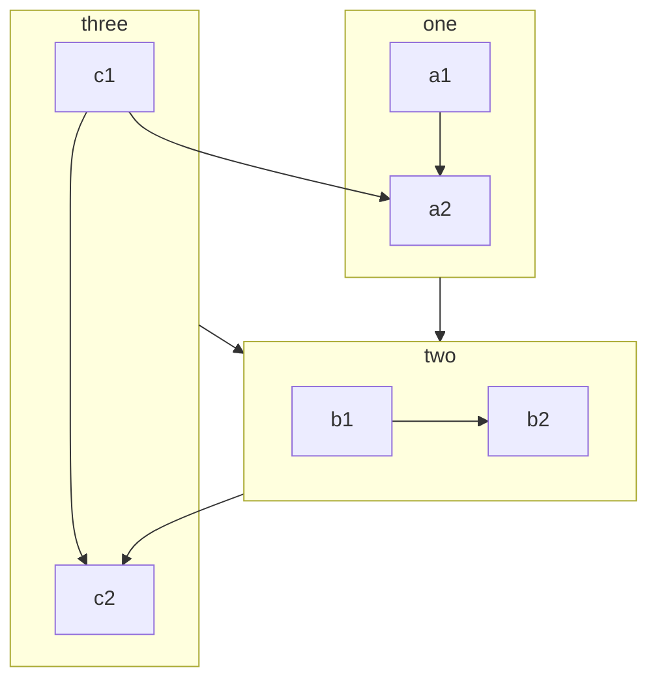

# ReadMe file for GitHub Repository "sc-testis_sum"

# analysis of single cell data available for testis

## all studies included here found in literature

Data from literature/NCBI Geo
Search terms: testis, single-cell

Only single cell RNA-seq data used (not bulk RNA or microarray)

| Title | Year | Author | Species |  Data Link |
|-------|------|--------|---------|------------|
| [Single-cell analysis of the developing human testis reveals somatic niche cell specification and fetal germline stem cell establishment](https://doi.org/10.1016/j.stem.2020.12.004)| 2021 | Guo et al.  | Human | [embryonic/fetal](http://www.ncbi.nlm.nih.gov/geo/query/acc.cgi?acc=GSE143356) and [postnatal](http://www.ncbi.nlm.nih.gov/geo/query/acc.cgi?acc=GSE161617)  |
| [The adult human testis transcriptional cell atlas](https://www.nature.com/articles/s41422-018-0099-2) | 2018 | Guo et al. | Human | [infant/adult](http://www.ncbi.nlm.nih.gov/geo/query/acc.cgi?acc=GSE120508)
| [The Neonatal and Adult Human Testis Defined at the Single-Cell Level](https://doi.org/10.1016/j.celrep.2019.01.045) | 2019 | Sohni et al. | Human | [neonatal/adult](http://www.ncbi.nlm.nih.gov/geo/query/acc.cgi?acc=GSE124263) |
| [Identification of Rat Testicular Leydig Precursor Cells by Single-Cell-RNA-Sequence Analysis](https://doi.org/10.3389/fcell.2022.805249) | 2022 | Guan et al. | Sprague Dawley Rats | [adult rat](https://ngdc.cncb.ac.cn/gsa/browse/CRA004958) |
| [Single-cell RNA sequencing of adult rat testes after Leydig cell elimination and restoration](https://www.nature.com/articles/s41597-022-01225-5) | 2022 | Guan et al. | Sprague Dawley Rats | [adult rat](https://ngdc.cncb.ac.cn/omix/release/OMIX767) |
| [Unified single-cell analysis of testis gene regulation and pathology in five mouse strains](https://elifesciences.org/articles/43966) | 2019 | Jung et al. | Mice (multiple strains) | [mice](https://www.ncbi.nlm.nih.gov/geo/query/acc.cgi?acc=GSE113293) |
| [A Comprehensive Roadmap of Murine Spermatogenesis Defined by Single-Cell RNA-Seq](https://doi.org/10.1016/j.devcel.2018.07.025) | 2018 | Green et al. | Mice | [adult mice](https://www.ncbi.nlm.nih.gov/geo/query/acc.cgi?acc=GSE112393) |
| [Single-cell RNA-seq uncovers dynamic processes and critical regulators in mouse spermatogenesis](https://www.nature.com/articles/s41422-018-0074-y) | 2018 | Chen et al. | Mice | [mouse spermatogenesis](https://www.ncbi.nlm.nih.gov/geo/query/acc.cgi?acc=GSE112393) |
| [Dynamic transcriptome profiles within spermatogonial and spermatocyte populations during postnatal testis maturation revealed by single-cell sequencing](https://journals.plos.org/plosgenetics/article?id=10.1371/journal.pgen.1007810) | 2019 | Grive et al. | Mice | [postnatal mice](https://www.ncbi.nlm.nih.gov/geo/query/acc.cgi?acc=GSE121904) |
| [Single-Cell RNA Sequencing of Human, Macaque, and Mouse Testes Uncovers Conserved and Divergent Features of Mammalian Spermatogenesis](https://doi.org/10.1016/j.devcel.2020.05.010) | 2020 | Shami et al. | Human, Macaque, Mice | [human, macaque, mice](https://www.ncbi.nlm.nih.gov/geo/query/acc.cgi?acc=GSE142585) |
| [A Single-Cell Atlas of In Vivo Mammalian Chromatin Accessibility](https://doi.org/10.1016/j.cell.2018.06.052) | 2018 | Cusanovich et al. | Mice | [chromatin availability, mice](https://www.ncbi.nlm.nih.gov/geo/query/acc.cgi?acc=GSE111586) |

mermaid syntax [link](https://mermaid-js.github.io/mermaid/#/)

